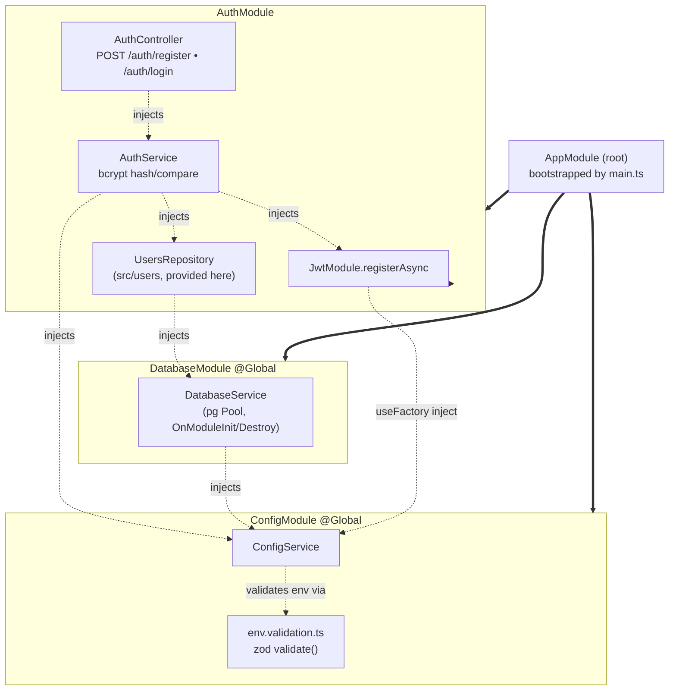

# Modular Architecture

NestJS module graph as it exists in `src/`. Each box is a module; nodes inside
are its controllers/providers. Solid arrows = module imports, dashed arrows =
constructor injection (dependency).

Solid arrows (`==>`) are the import tree, branching down from `AppModule`.
Dashed arrows (`-.->`) are constructor injections.

**Notes**
- `ConfigModule` and `DatabaseModule` are `@Global`, so their exports
  (`ConfigService`, `DatabaseService`) are injectable anywhere without re-importing.
- There is no `UsersModule`; `UsersRepository` lives in `src/users/` but is
  registered as a provider inside `AuthModule`.
