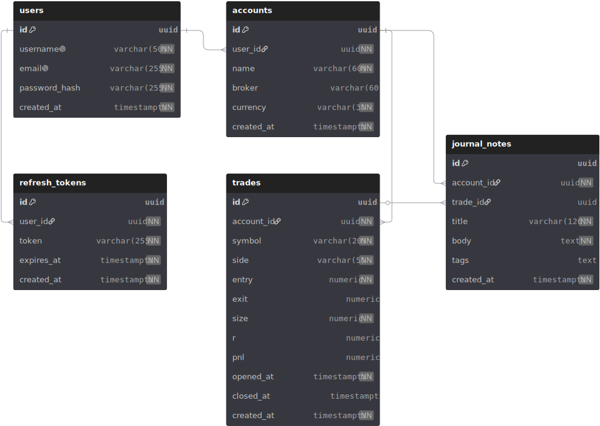

# Tradel

#### **The trading journal built in 🇲🇦 for traders who take their edge seriously.**

**Tradel** is a one-of-a-kind & first trading journal born in Morocco, home of the **Bourse de Casablanca** made for traders everywhere. Most traders lose not because of bad strategies, but because they never *study their own trading*. Tradel fixes that: log every trade, organize your accounts, and turn raw execution history into insight, so you stop repeating the mistakes that drain your account.

### Under the hood

Here is the database structure powering Tradel; users, sessions, and trading accounts, and how they relate to each other (designed with [dbdiagram](https://dbdiagram.io)):

<p align="center">
  
</p>

## Why Tradel?

- **Know thyself, trader.** Your journal is your mirror, every entry, exit, and emotion recorded in one place.
- **Multi-account by design.** Prop firm challenge, personal account, demo, keep each broker account separate and clean.
- **Your data, your rules.** Self-hostable, open, no vendor lock-in. Run it on your own machine with one Docker command.
- **Built from Morocco, for the world.** A first-of-its-kind trading tool from the Moroccan dev scene, proof that world-class trading software can come from anywhere.

##  What you get

| | |
|---|---|
|  **Secure accounts** | Register/login with hashed passwords (bcrypt) and JWT access + refresh tokens |
|  **Trading accounts** | Create and manage multiple broker accounts, each with its own name, broker, and currency |
|  **Session safety** | Refresh tokens stored as httpOnly cookies, hashed server-side, sessions can be revoked anytime |
|  **Coming next** | Trade logging, stats, and performance analytics on top of this foundation |

---

## Tech Stack

| Layer | Technology |
|---|---|
| Backend | NestJS 11 + TypeScript |
| Frontend | Next.js (App Router) + Tailwind |
| Database | PostgreSQL 16, raw SQL via `pg`, migrations with `node-pg-migrate` |
| Auth | JWT access tokens + opaque refresh tokens (sha256-hashed at rest) |
| Validation | class-validator (DTOs) + Zod (env, validated at boot) |

## Quick Start

```bash
# 1. Database (custom PostgreSQL 16 image)
docker-compose up -d

# 2. Backend
cd backend
cp .env.example .env      # fill in DB + JWT values
npm install
npm run migrate:up
npm run start:dev         # http://localhost:3000/api

# 3. Frontend
cd frontend
npm install
npm run dev
```

## API at a glance

All routes prefixed with `/api`.

| Endpoint | What it does |
|---|---|
| `POST /api/auth/register` | Create an account |
| `POST /api/auth/login` | Get access token + refresh cookie |
| `POST /api/auth/refresh` | Mint a new access token |
| `POST /api/auth/logout` | Revoke the session |
| `POST /api/accounts` | Add a trading account 🔒 |
| `GET /api/accounts` | List your trading accounts 🔒 |

🔒 = requires `Authorization: Bearer <access token>`

## Structure

```
tradel/
├── backend/     # NestJS API, auth, accounts, migrations
├── frontend/    # Next.js app
├── database/    # Custom PostgreSQL 16 Docker image
└── assets/      # Diagrams (schema above made with dbdiagram)
```

---

<p align="center">
  Made with ❤️ in Morocco 🇲🇦
</p>
