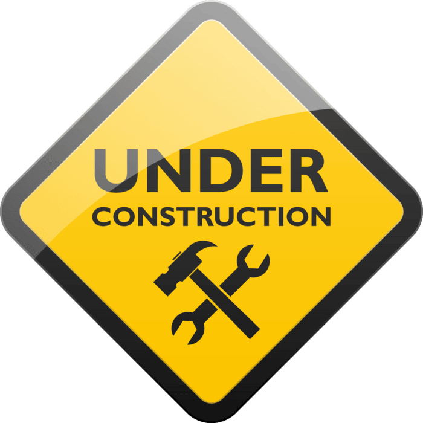

  

<h1 align="center">Tradel</h1>

  <strong>The open-source trading journal and performance review platform.</strong> 
  Record every trade. Understand your results. Improve with real data.

  Born in Morocco 🇲🇦 · For traders everywhere

  

  <strong>Tradel is under active development.</strong> 
  The platform works today, and there is much more to come.

## Trading gives you results. Tradel helps you understand them.

A winning trade is not always a good trade. A losing trade is not always a bad trade. The result alone does not tell you whether you followed your plan, managed risk well, or repeated an old mistake.

Tradel keeps your trades, notes, accounts, and performance data in one place. It turns a list of entries and exits into a clear review process, so you can see what works, what does not, and what needs to change.

  

## How it works

1. **Create a trading account** — keep personal accounts, demo accounts, broker accounts, and prop-firm challenges separate. Each account can have its own broker, starting balance, currency, and trade history.
2. **Log a trade** — record the market symbol, long or short direction, entry, exit, lot size, profit or loss, and risk-to-reward result.
3. **Add the story behind it** — attach notes to explain your idea, your plan, what happened, and what you learned.
4. **Review the data** — use simple charts, statistics, filters, and calendar views to find patterns across your trades.
5. **Make the next trade better** — repeat what works and stop repeating mistakes that cost you money.

## One clear workspace for your trading

| What you get | What it helps you do |
| --- | --- |
| **Performance dashboard** | See total P&amp;L, win rate, best trade, average risk-to-reward, and recent activity at a glance. |
| **Trade log** | Search, filter, sort, edit, and review your closed trades without losing the details. |
| **Equity curve** | Follow the growth and drawdown of an account trade by trade. |
| **Trading calendar** | See daily P&amp;L and trading activity on the exact day it happened. |
| **Analytics** | Compare results by symbol and trade direction to see where your performance is strongest or weakest. |
| **Journal notes** | Save the reasoning, lessons, and context that numbers cannot explain on their own. |
| **Multiple accounts** | Keep different brokers, currencies, demo accounts, and prop challenges organized. |
| **Live demo** | Explore a complete journal with sample data before creating an account. |

## Built for traders who want honest feedback

Tradel is useful for new traders learning how to review their work, experienced traders testing whether an edge is still working, and prop-firm traders who need to keep several challenges separate.

It does not tell you what to buy or sell. It does not place trades for you. It is not a broker, an exchange, or a signal service. You stay in control of every decision. Tradel simply helps you study those decisions after the trade.

## Open by design

Tradel is open source because traders should be able to understand and control the tools that hold their trading history. You can inspect the project, self-host it, suggest a feature, report a problem, or help build the next version. There is no hidden system deciding how you should trade.

The current version is free to use and includes the main journal and review experience. The [product roadmap](PRODUCT_ROADMAP.md) shows what is planned next, including broker imports, deeper risk tracking, playbooks, review routines, and more flexible reports.

Want to help? Read the [contribution guide](CONTRIBUTING.md) and join the project as a trader, designer, writer, or developer.

> Tradel is a journaling and analysis tool. It does not provide financial advice or promise profitable results.

  <strong>Trade. Review. Improve. Repeat.</strong> 
  Made with care in Morocco 🇲🇦

